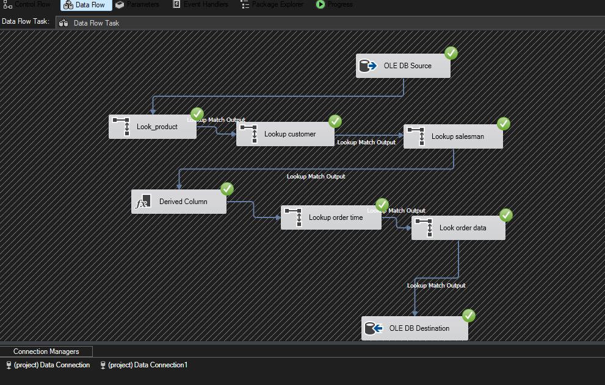

# 🏗️ SSIS Sales ETL Data Warehouse Project

## 📌 Overview

This project demonstrates a complete **ETL pipeline using SSIS** to transform data from an OLTP system into a structured Data Warehouse.

The pipeline performs:

* Incremental data loading
* Data transformation
* Dimension and Fact table population

---

## 🎯 Project Objective

To simulate a real-world **Data Engineering workflow** by:

* Extracting data from OLTP database
* Transforming it using SSIS
* Loading it into a Data Warehouse (Star Schema)

---

## 🗄️ Source System (OLTP)

Database: `Sales_OLTP`

Tables include:

* Customer
* Orders
* OrderDetails
* Product
* Salesman
* Category

---

## 🏢 Data Warehouse (DWH)

Database: `Sales_Dwh`

### ⭐ Fact Table

* Fact_sales

### 📊 Dimension Tables

* DimCustomer
* DimProduct
* DimDate
* DimSalesman

---

## 🔄 ETL Process

### 1️⃣ Control Flow

Steps:

* Get last load date
* Execute Data Flow Task
* Update last load date

---

### 2️⃣ Data Flow

Process:

* Extract data from source
* Perform lookups:

  * Product
  * Customer
  * Salesman
  * Date
* Apply transformations (Derived Column)
* Load into Fact table

---

### 3️⃣ Data Warehouse Schema

---

## ⚙️ Key Features

* Incremental Load (based on last load date)
* Lookup transformations for dimension keys
* Star Schema design
* Clean separation between OLTP and DWH

---

## 🛠️ Tools Used

* SQL Server
* SSIS (SQL Server Integration Services)
* T-SQL

---

## 🚀 How It Works

1. Extract new data from OLTP
2. Transform using SSIS
3. Map dimension keys using Lookups
4. Load into Fact table
5. Update last load timestamp

---

## 💡 Future Improvements

* Add Slowly Changing Dimensions (SCD Type 2)
* Use SSIS logging & error handling
* Automate scheduling using SQL Server Agent

---

## 👤 Author

Mohamed Shahat
